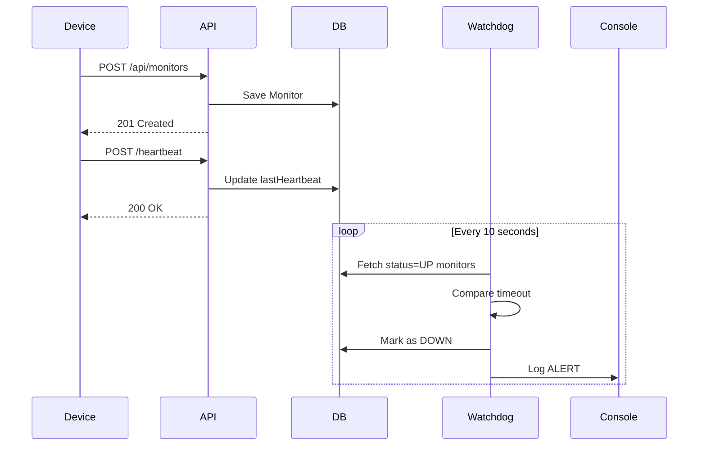

# Pulse-Check-API (Watchdog Sentinel)

## Overview

Pulse-Check-API is a Dead Man’s Switch backend service for monitoring remote infrastructure devices.

If a device fails to send a heartbeat within a configured timeout, the system marks it as DOWN and triggers an alert.

MongoDB is the source of truth. The system is restart-safe.

---

## Architecture

- Node.js + Express
- MongoDB (Persistent Storage)
- Async Watchdog Background Job
- Global Error Handling Middleware

---

## Sequence Diagram



---

## Setup Instructions

### 1. Clone Repository

```
git clone https://github.com/yourusername/pulse-check-api.git
cd pulse-check-api
```

### 2. Install Dependencies

```
npm install
```

### 3. Configure Environment

Create a `.env` file:

```
PORT=5000
MONGO_URI=your_mongodb_connection_string
```

### 4. Start Server

Development:

```
npm run dev
```

Production:

```
npm start
```

---

## API Documentation

### Create Monitor

POST `/api/monitors`

Body:
```
{
  "id": "device-123",
  "timeout": 60,
  "alert_email": "admin@critmon.com"
}
```

---

### Heartbeat

POST `/api/monitors/device-123/heartbeat`

---

### Pause Monitor

POST `/api/monitors/device-123/pause`

---

### Get Status

GET `/api/monitors/device-123/status`

Response:
```
{
  "deviceId": "device-123",
  "status": "up",
  "timeRemaining": 42
}
```

---

## Developer’s Choice Feature

### Status Endpoint

Added `GET /monitors/:id/status`.

Reason:
Improves observability and operational debugging. Engineers can instantly see device state and remaining time.

---

## Deployment Recommendation

Use Render:

1. Push project to GitHub
2. Create MongoDB Atlas cluster
3. Create new Web Service on Render
4. Add environment variables
5. Deploy
