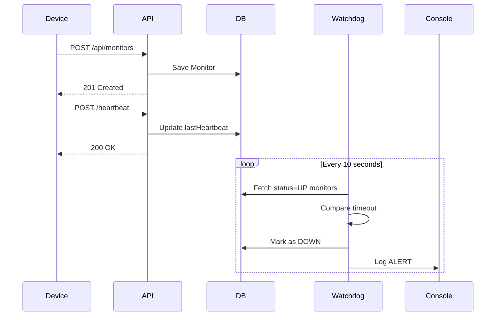

# Pulse-Check-API (Watchdog Sentinel)

## Overview
Pulse-Check-API is a Dead Man’s Switch backend service designed to monitor remote infrastructure devices operating in unreliable or low-connectivity environments.

Each device registers a monitor with a configured timeout. The device must periodically send heartbeat signals to confirm it is still operational. If the system does not receive a heartbeat within the expected interval, the device is automatically marked as down and an alert is triggered.

This system models real-world infrastructure monitoring scenarios such as solar farms, weather stations, and remote IoT installations where device failure must be detected reliably without manual intervention.

## Problem Context
CritMon Servers Inc. monitors critical infrastructure devices deployed in remote areas. These devices are expected to send periodic “I am alive” signals.

The key challenge is detecting device failure automatically when those signals stop.

The absence of communication must be treated as a failure condition.
This project implements that logic in a reliable, restart-safe backend service through the use of persistentt storage.

---

## Architecture Overview
The system consists of four main components:

- ##### Express API
Handles monitor registration, heartbeat processing, pause functionality, and status inspection.

- ##### MongoDB (Source of Truth)
Stores monitor state persistently, including last heartbeat time and timeout configuration. This ensures system state survives server restarts.

- ##### Watchdog Background Service
A periodic asynchronous process that evaluates monitor state and detects timeout violations.

- ##### Alert Mechanism (Simulated)
When a monitor expires, the system logs a structured alert. In production, this would trigger an email or webhook.

---

### Architectural Design Decision: Database-Driven Timeout Detection

A key design decision was to avoid relying on in-memory timers such as setTimeout.

In-memory timers are fragile because they are lost when the server restarts. This creates blind spots where device failures would go undetected.

Instead, this system stores all timing state in MongoDB and evaluates expiration asynchronously using a watchdog process.

This provides:

* Restart safety
* Persistence
* Horizontal scalability readiness
* Operational reliability

The database acts as the source of truth.
Timeout expiration is derived from:
lastHeartbeat + timeout


---

## Sequence Diagram




---
## Monitor Lifecycle

A monitor can exist in one of three states:

* UP
The device is sending heartbeats within the timeout window.
* DOWN
The device has exceeded the timeout without sending a heartbeat.
* PAUSED
Monitoring is temporarily suspended. No alerts will trigger.

 ##### State transitions occur automatically based on heartbeat activity or pause commands.
---
### Project Structure
```
pulse-check-api/
│
├── src/
│   ├── config/db.js
│   ├── controllers/monitorController.js
│   ├── middleware/errorHandler.js
│   ├── models/Monitor.js               
│   ├── routes/monitorRoutes.js
│   ├── services/watchdogService.js 
│   └── server.js                        
|   └── public /index.html               
│
├── .env
├── package.json
└── README.md
```
##### This structure separates concerns clearly:
- Controllers handle request logic
- Models define data structure
- Services handle background processing
- Middleware handles cross-cutting concerns
- Routes define API endpoints
- Public/index - simple frontend for docs.
---
##### List of API endpoints:
###### Create a Monitor (POST /api/monitors/)
- sample data to pass in below:
```
{
  "id": "device-123",
  "timeout": 60,
  "alert_email": "admin@example.com"
}
```
other endpoints available are;
- send Heartbeat  ```POST /api/monitors/:id/heartbeat ```
- pause Monittor heartbeat  ```POST /api/monitors/:id/pause ```
- get Monitor status  ```GET /api/monitors/:id/status ``` 

---
### Failure Detecture Logic
- The watchdog service runs in a loop, listening for monitors elapsedTime (can be changed by admin) 
  ``` elapsedTime = currentTime - lastHeartBeat```
  if ```elapsedTime > timeout ``` then
  - ``` monitor.status = down```  => ``` alert is triggered```
---

## How to Run Locally 

### 1. Clone Repository

```
git clone https://github.com/yourusername/pulse-check-api.git
cd pulse-check-api
```

### 2. Install Dependencies

```
npm install
```

### 3. Configure Environment

Create a `.env` file:
Create a database collection on Mongo DB and copy your URI into the local ```.env``` file. 

```
PORT=5000
MONGO_URI=your_mongodb_connection_string
```

### 4. Run the development Server

Development:

```
npm run dev
```


---
## Developer’s Choice Feature

#### Status Endpoint

Added `GET /monitors/:id/status`.

Reason:
Improves observability and operational debugging. This allows operators to inspect monitor state and remaining time without accessing the database directly.


#### Conclusions
This implementation is restart-safe because all state is stored in MongoDB.
Potential production improvements include:

- `Real Webhook/email alert integrations`
- `Authentication and API key support`
- `Rate limiting`
- `Monitoring and observability integration`
---

## Deployment Recommendation

This API can be deployed easily on most platforms, render was used to host it on mine. Please refer to render docs on how to. To deploy;

1. Fork project from GitHub to your repo
2. Create MongoDB Atlas cluster
3. Create new Web Service on Render
4. Add environment variables
5. Deploy and Test it out.
   
  
### Author
` Etornam Kordo Ahiataku`
`GitHub:` [Live Demo](https://pulse-check-api.onrender.com/)
